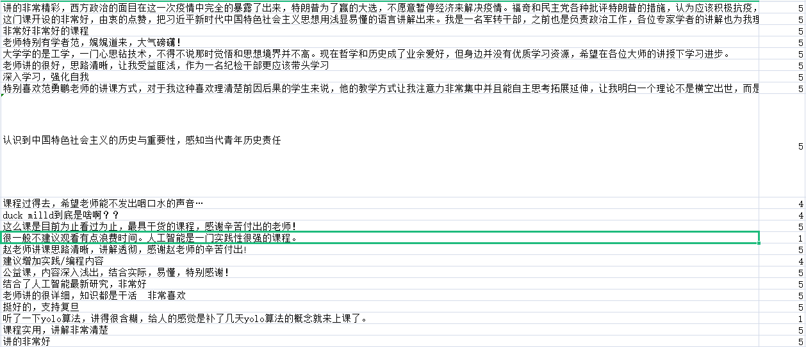

##  代码说明
> moocSpider.py
### **功能**
爬取中国大学MOOC上所有课程的评论信息并保存到本地，因为评论数较多，固分成了10个csv文件。已上传到comments_origin文件夹里。\
**最新数据：3.27 438所高校 共9047个课程 170万+评论数**\


### **类**
```python
class icourse163_spider()
```

### **功能函数**
```python
def __update_cookie(self,res)
```
更新cookie，网站采用了CSRF token防止跨域请求，其值在cookies中的NTESSTUDYSI，故后面请求后端ajax文件时必须带上该参数。\
一开始的想法是将其他cookie值作为常量，只要每次请求前单独更新一下NTESSTUDYSI即可，但仍然会被网站拦截，故只能每次手动更新所有cookies值，所以该函数暂时没用...
```python
def __request_get(self,url)
```
单独写一个GET请求函数并返回BeautifulSoup类型，用于前端爬取数据.
```python
def __get_school_urls(self)
```
前端爬取a标签获取所有高校的URL.
```python
def __get_school_ids(self)
```
通过请求每个高校URL，前端爬取它们对应的学校Id.
```python
def __get_course_ids(self)
#............
    data={
        "schoolId":"学校Id",
        "p":1,                #请求页码
        "psize":20,           #返回的结果个数
        "type":1,
        "courseStatus":30
        }
```
通过请求ajax获取每个学校所有的课程Id，即POST data中的"schoolId".
```python
def __get_course_comments(self)
#............
    data={
        "courseId":"课程Id",
        "pageIndex":1,
        "pageSize":20,
        "orderBy":3
        }
```
通过请求ajax获取每个课程所有的评论数据，即POST data中的"courseId".\
**这里舍弃给分为3的评论（>3赋值为1，<3赋值为0）.**
```python
def __parse_comments(self)
```
对每条评论数据提取出评论"comment"和生成情感"sentiment"，形成字典.
```python
def save_course_ids(self)
```
```python
def save_csv(self)
```
分别是保存课程Id和评论数据csv，因为数据过于庞大，为避免服务器无响应或者反爬，固这里先将课程Id保存到本地，每次再读取一部分来请求评论数据.
```python
def run_get_courses_ids(self)
```
```python
def run_parse_comments(self)
```
分别是执行“请求和保存课程Id”和“请求和保存评论数据”的主执行代码.\
这里用到线程库threading中的Thread函数以及队列queue中的先进先出队列Queue提高请求和分析的速度.
### **执行**
```python
if __name__=="__main__":
    spider=icourse163_spider()
    spider.run_get_courses_ids() #先跑
    #spider.run_parse_comments() #后跑
```
### **原始csv文件效果预览**
第一列为评论comment，第二列为情感值sentiment **（打分>3赋值为1，<3赋值为0）**
